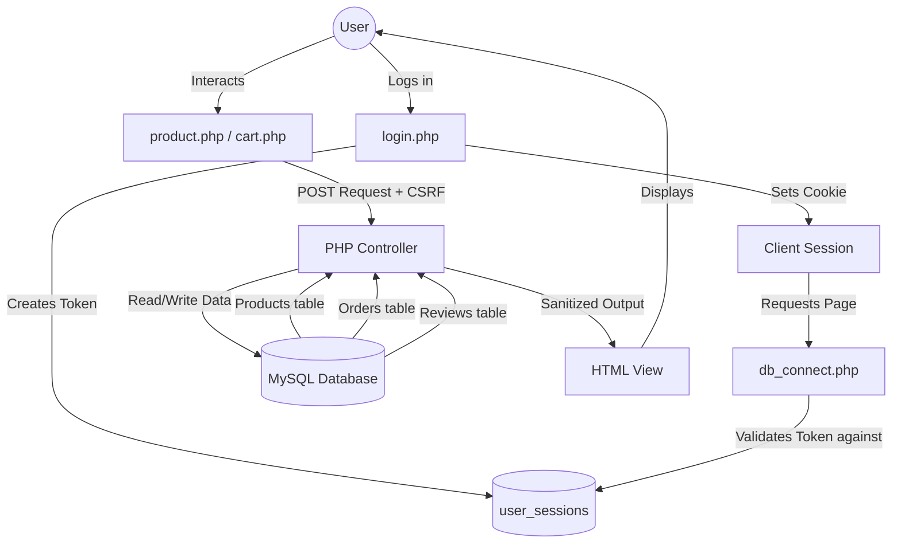

# EKEA Complete Project Report

This document provides a comprehensive breakdown of all features, security hardening, UI/UX polish, and flow mechanics implemented in the EKEA e-commerce website. 

---

## 1. Detailed Changes & Enhancements

### 🛡️ Security & Session Management
- **Authentication Library**: Uses `delight-im/auth` v8.x for secure registration, login, email verification, and role management. Sessions are managed by the library.
- **Admin Control**: The **Manage Users** panel displays user details and session status. Admins can manage roles and force-logout any user.
- **HTTP Headers**: Added strict `Content-Security-Policy` (CSP) whitelisting CDNs (Stripe, Chart.js, Bootstrap, Leaflet), `X-Content-Type-Options: nosniff`, `X-Frame-Options: SAMEORIGIN`, from XSS and clickjacking.
- **Cookie Hardening**: Configured PHP session cookies with `HttpOnly`, `SameSite=Strict`, and `use_strict_mode` enabled.
- **IDOR & XSS Protection**: Database queries strictly use `$auth->getUserId()` for user ownership validation. Output is escaped uniformly using `htmlspecialchars(... ENT_QUOTES, 'UTF-8')`.

### 🎨 UI/UX & Accessibility Polish
- **WCAG AA Compliance**: Fixed contrast ratios. The `.text-accent` color was darkened to `#7A5A10` (6.3:1 contrast ratio passing both AA and AAA).
- **Material Design Standards**: Enforced a minimum **48×48dp** touch target for interactive elements. Button text labels ("Remove", "Search", "Lookup", "Promote/Delete") were added alongside all icons.
- **Focus Indicators**: Added highly visible outlines (`focus-visible`) for smooth keyboard navigation.
- **Cart & Quantity Experience**: 
  - Standardized `+/-` quantity buttons across the entire site (`cart.php` and `product_detail.php`), hiding default browser number spinners on `readonly` numerical inputs.
  - Adding an item triggers a **cart shake animation** (0.6s keyframe) in the navbar.
  - Decreasing quantity to `1` and clicking `-` triggers a **Bootstrap confirmation modal** asking if the user wants to remove the item (replacing native browser dialogues).
  - The "Clear Cart" button also uses a themed Bootstrap modal.
- **Visual Aesthetics (Von Restorff Effect)**: On the homepage, the first two featured products are rendered larger while the rest are smaller, creating visual hierarchy.
- **Product Filtering**: Added the ability to sort by "Oldest First", customized the dropdown styling, and added a dynamic "All Products" badge. Auto-fill logic supports populating the coupon code via URL parameters in checkout.
- **Footer Revamp**: Removed dead links. The "Company" and "Account" links are now mapped securely. The footer proudly displays: **"Built by P4-Team 12 in Singapore"**.

### 📊 Admin capabilities (Chart.js Integration)
- **Admin Dashboard**: Visualized operations with 5 distinct charts:
  - **Revenue by Category** (Doughnut Chart)
  - **Order Status Distribution** (Pie Chart)
  - **Sales Trend** (Line Chart tracking daily revenue)
  - **Stock Levels** (Bar Chart highlighting low stock)
  - **Top Selling Products** (Horizontal Bar Chart)
- **Public Analytics**: Implemented a "Rating Distribution" bar chart on the `news.php` reviews page and a "Spending Trend" line chart on the `history.php` order history page.

---

## 2. User Flow

The platform guides users through an intuitive, e-commerce lifecycle:

1. **Discovery**: A guest navigates to `index.php` and browses the "Featured Collection" showcasing the Von Restorff visual hierarchy. They hover over an item and click "View Details" to reach `product_detail.php`.
2. **Evaluation**: On the product page, the user views product info, checks the "In Stock" badge, and reads existing reviews.
3. **Action (Cart)**: The user clicks `+` to update the quantity (native input spinner is hidden) and clicks **"Add to Cart"**. 
   - *Feedback*: A flash message appears, and the cart icon in the navbar shakes.
4. **Checkout Prep**: Navigating to `cart.php`, the user can further manage quantities. If they decrement an item below 1 or click "Remove", a customized modal asks for confirmation. They then proceed to `checkout.php`.
5. **Authentication Intervention**: If not logged in, `auth_guard.php` redirects the user to `login.php`. Upon successful login, their new session invalidates any old ones, and an IPv4 footprint is logged.
6. **Checkout & History**: The user completes payment/shipping info in checkout. They can track the order in `history.php`, which visually displays their spending trend via a Chart.js graph.
7. **Post-Purchase**: Once an order status is marked "Delivered" by an admin, the user is authorized to leave a star rating on `news.php` or the product page.

---

## 3. Code Flow

The structure utilizes a clean, procedural MVC-lite pattern in PHP:

- **Routing & Entry**: Requests hit specific `.php` pages (e.g., `cart.php`).
- **Bootstrap / Initialization**: 
  - Every page begins by importing `includes/db_connect.php`, which starts the session, sets strict cookies, and initializes the secure `$pdo` connection and `$auth` instance (delight-im/auth).
  - `includes/auth_guard.php` is required on protected routes to verify the user is logged in via `$auth->isLoggedIn()`.
- **Controller Logic**: At the top of the file, PHP processes any `POST` requests (e.g., `isset($_POST['add_to_cart'])`). CSRF tokens (`$_POST['csrf_token']`) are validated immediately. Success/failure states trigger `$_SESSION['flash_message']` and a `header('Location: ...')` redirect (PRG pattern). Cart stock validation ensures quantities never exceed available inventory.
- **Data Fetching**: The mid-section prepares SQL statements via `$pdo->prepare()` to fetch the necessary data for the view (e.g., `$stmt->fetchAll()`).
- **View Rendering**: The UI is rendered at the bottom. 
  - `includes/header.php` injects the CSP headers and output layout. 
  - The DOM uses `htmlspecialchars()` to safely render the fetched data.
  - `includes/footer.php` closes the structure and conditionally loads `chart.umd.min.js` or `main.js`.
- **Client-Side execution**: Once the DOM loads, `js/main.js` attaches listeners for quantity control logic, auto-submits forms during cart edits, activates Bootstrap modal integrations, and controls scroll animations.

---

## 4. Data Flow

Data integrity and security are at the core of the database schema:

1. **Authentication Flow**: User credentials are managed by the `delight-im/auth` library with secure password hashing and email verification. A 64-byte CSRF token securely ties their temporary active window to their `$_SESSION`.
2. **Transaction Flow**: Cart data is stored transiently in `$_SESSION['cart']` with server-side stock validation. Upon checkout, the server verifies quantities against DB stock, auto-adjusts if needed, then maps the cart to persistent `orders` and `order_items` tables inside a single database transaction.
3. **Reporting Flow**: The `admin/api/chart_data.php` endpoint queries aggregate data (e.g., `SUM(total)`, `COUNT(status)`), packages it into JSON format, and pipes it directly into the client-side Chart.js instances for visual dashboarding.
